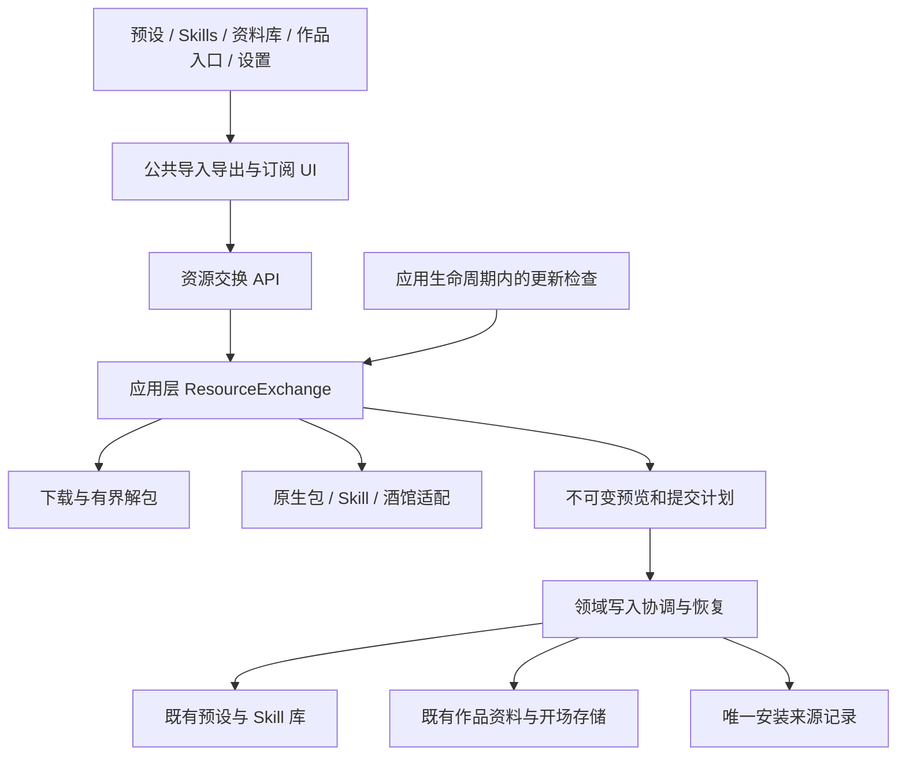
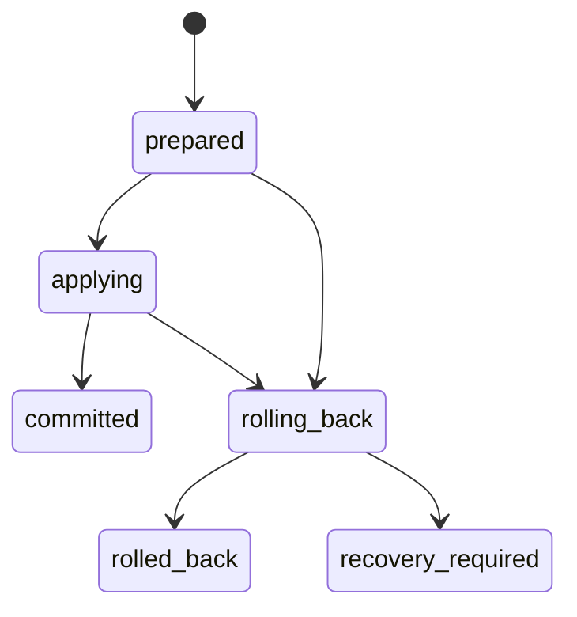

# 资源包导入、导出与订阅更新设计

- 状态：设计方案，尚未实现；本文中的新 API、类型和目录均为目标设计。
- 日期：2026-09-22。
- 代码核对基线：`1161b57bd1afee2db6da20af652bbfa13defe05a`。
- 范围：方案预设、Skills、资料库、酒馆角色卡，以及这些内容的组合分发。
- 约束来源：[AGENTS.md](../AGENTS.md)。实现完成后，将仍有独立价值的协议与使用说明转为维护文档，删除被实现和测试覆盖的设计过程。

## 1. 决策摘要

统一资源包格式、导入预览、来源记录与更新机制；保留方案预设、Skills、资料库中的快捷入口和编辑器。

全局管理入口放在「设置 → 导入与订阅」，负责查看来源、批量检查更新、处理冲突和管理组合包的导出定义。它不保存第二份资源正文，不承担各模块的编辑功能，也不增加写作/游戏模式切换。

第一版必须同时支持：

1. 从 GitHub 或本地文件导入，识别 Denova 资源包、普通 Skill 目录包和酒馆 PNG/JSON。
2. 单个预设、单个 Skill、选中资料、整个资料库和跨模块组合包导出。
3. GitHub 来源的手动检查、自动检查并提醒；默认手动。保留现有 Skills 的自动安装能力，并将检查与安装明确区分。
4. 来源可追踪、本地修改受保护、预览内容与实际安装一致、覆盖有备份、失败可恢复。
5. 写作和游戏使用同一套能力；资料和开场绑定明确的作品，预设保持全局作用域。

第一版不包含资源市场、GitHub 发布/推送、私有仓库登录、任意网站爬取、跨包依赖下载、三方自动合并、自动删除上游移除的资源、无损回写酒馆卡、作品备份或会话恢复。资源包不携带 API Key、模型账户、会话、游戏进度或自动执行任务。

## 2. 现有能力与需要扩展的边界

| 已核对的现状 | 设计中的处理 |
| --- | --- |
| [预设目录](../internal/presetlayout/layout.go)位于全局 `presets/`，包括叙事风格、图像、游戏规划、事件、规则和状态预设 | 保留原目录和领域校验，不为资源包另建预设库 |
| [ResourceCatalog](../internal/app/resourcecatalog/service.go)聚合全局预设、文风参考和 Skills | 复用查询与领域服务；导入事务和来源管理由独立应用服务编排 |
| [Skills 安装](../internal/agents/skills/install.go)支持 ZIP 扫描、预览和安装，[远程来源](../internal/agents/skills/remote.go)支持 GitHub 与 HTTPS ZIP | 提取确实共用的下载、解包能力，保留 Skill 解析与名称规则 |
| [Skills 更新](../internal/agents/skills/updates.go)区分检查与安装，有本地摘要保护和替换备份 | 扩展成统一来源管理；原自动更新明确映射到 `auto_apply` |
| [Skills 文档](skills-library.md)规定自动更新默认关闭、共享 Skills 单独启用 | 保留用户已作出的选择；不修改 `~/.agents/skills` |
| [资料存储](../internal/book/lore/lore_storage.go)以作品的 `setting/lore/items.json` 为正文事实源 | 包中可逐条表示，导入后仍合并回原集合文件 |
| [酒馆导入](../internal/book/character/import.go)会生成资料、开场和封面，并提供兼容性报告 | 接入公共流程，保留领域转换；现有内存快照不等于跨进程恢复事务 |
| [revisionjson](../internal/revisionjson/store.go)已有内容版本校验和原子文件替换 | 复用单文件机制；多文件提交需要额外定义提交记录、共享写入边界和恢复顺序 |

这些是静态代码核对结果，不代表本文新增能力已经通过运行验证。

## 3. 产品行为

### 3.1 入口与职责

| 入口 | 默认行为 |
| --- | --- |
| 方案预设列表「导入」 | 预选预设资源；目标为用户全局库 |
| 预设或 Skill 单项菜单 | 导出此项、查看来源、检查更新；有来源时显示更新状态 |
| Skills「导入」 | 保留普通 Skill 仓库和 ZIP 的直接导入体验 |
| 资料库「导入/导出」 | 默认当前作品；可导出选中条目或全部条目，全部包含禁用条目 |
| 作品列表「从文件或链接创建」 | 支持角色卡和资源包；用户确认后创建 Book Project |
| 设置「导入与订阅」 | 全部安装、订阅、有更新、需处理；导入内容、批量检查和导出组合包 |

所有入口打开同一套导入流程。入口只影响默认勾选和目标，不限制识别能力；从 Skills 页面打开混合包时，其他内容仍然可见。

### 3.2 导入流程

1. **选择来源**：粘贴 GitHub/HTTPS ZIP 链接，或上传 ZIP、PNG、JSON。
2. **识别内容**：显示包名、作者、格式、资源类型/数量、来源和兼容性；一个仓库有多个候选包时先选择候选。
3. **选择内容和目标**：显示必要依赖；预设进入全局库，Skills 选择用户或指定 Project，资料/开场进入当前、其他或新建作品。
4. **确认导入计划**：列出每项新增、复用、替换、重命名、跳过及不能导入的原因；同时显示来源跟踪和更新策略。
5. **执行并展示结果**：可直接打开导入的内容。不同包分别报告成功或失败；同一包本次选择的内容整体提交或回滚。

一次包安装最多写入一个 Project，加上该包需要的全局资源。导入到多个作品是多次独立安装，分别记录本地修改和版本。当前前台作品切换不会改变已经生成的计划目标。

全局预设只能导入为自定义资源，不允许导入覆盖内置 ID。导入到已有作品时，替换作品封面必须单独选择，默认保留原封面。导入开场不自动创建或启动游戏，也不切换正在使用的方案。

### 3.3 导出流程

- 单项菜单预选当前资源；资料库支持选中/全部；组合导出允许继续加入其他模块的资源。
- 预览显示资源、依赖、附件、文件大小和不能便携导出的引用。必要依赖默认加入；不能得到完整内容时阻止相关资源导出，不生成断链包。
- 原生输出统一为 `*.denova.zip`，普通 `.zip` 仍按清单识别。单个 Skill 另提供「标准 Skill ZIP」，保持 `SKILL.md` 生态可用性。
- 导出采用明确的字段白名单，不直接压缩 `.denova`、Project Store 或整份后端对象。凭据、内部路径、安装记录和更新授权不进入分发包。
- 保存轻量的导出定义，支持「再次导出此包」和「另存为新包」；同一定义保留包 ID 和资源 ID，另存新包生成新 ID。
- 导出的文件可由用户自行上传 GitHub；本功能不代用户创建仓库或发布内容。

### 3.4 订阅和更新策略

| `update_mode` | 行为 | 可用范围 |
| --- | --- | --- |
| `manual` | 不做后台网络检查；用户主动检查、预览和应用 | 默认；所有可跟踪来源 |
| `notify` | 定期检查并显示更新提示，不替换正文 | 可跟踪来源，包括来自 GitHub 的资料包和角色卡 |
| `auto_apply` | 自动检查后安装符合条件的更新 | 仅由预设、文风参考、Skills 组成的安装 |

包含作品资料、开场、封面或酒馆转换结果的安装，第一版只支持 `manual`、`notify`。设置不支持的模式返回明确错误，不静默降级，也不只自动替换混合包中的一部分。

GitHub 导入默认保存可手动检查的来源，策略为 `manual`。本地文件只是一次导入：清单里的主页、更新链接和上传包携带的安装元数据都不能授予订阅或自动安装权限。需要订阅时，用户输入来源并通过匹配预览确认；无法确认同源时建立新安装。

订阅详情同时展示远程状态和本地状态。例如「上游有更新 · 本地已修改」可以同时存在。取消订阅只停止跟踪，保留内容和来源署名；删除内容仍由对应模块的删除操作完成。

### 3.5 酒馆角色卡

角色卡是输入格式，转换结果是 Denova 的资料、开场和图片，不增加第四套内容库。

- 保留 PNG/JSON、内嵌世界书、备用开场、玩家名称替换、语义分类选项和兼容性报告。
- 确认前展示将保留、转换、过滤或截断的内容；沿用现有兼容性规则，不宣称支持酒馆运行时扩展。
- 网络来源可以检查原卡是否变化。应用更新必须重新预览；后台检查不运行语义分类，也不消耗模型调用。
- 语义转换在生成安装计划之前完成，结果冻结在计划中；提交阶段不再次调用模型。
- 原卡缺少稳定条目标识且结构变化时，不按名称或新的数组下标猜测对应关系，提示导入副本或人工确认。
- 转换后的内容导出为 Denova 包；不承诺原卡格式无损往返。

## 4. 核心模型与身份

### 4.1 四个不同概念

| 概念 | 职责与身份 |
| --- | --- |
| Source | 从哪里读取；GitHub 仓库/ref/包路径、HTTPS ZIP，或一次本地上传 |
| Package | 分发清单；稳定 `package_id`，可包含不同种类的资源 |
| Resource | 可编辑的领域对象；包内以稳定 `resource_id` 标识，导入后映射到原有领域 ID |
| Installation | 某个包的一次目标绑定；稳定 `installation_id`，拥有来源、策略和资源映射 |

包名、作品显示名、DataRoot、绝对路径均不参与身份。资源身份是 `(package_id, resource_id)`；同包在两个作品中的 Installation 独立。跨来源碰巧出现相同包 ID，视为来源冲突，不能自动接管。

同一领域对象最多被一个有效 Installation 跟踪。重复导入同源同目标先显示已有安装；完全一致为 `unchanged`，不创建重复资料。用户选择副本时生成新的本地 ID 和 Installation，默认手动，不转移原安装的订阅。

现有 Skill 的本地定位仍使用 scope/name，文风参考使用 `styles/` 下的规范相对文件名；不为所有现有资源强制增加 UUID。应用内重命名需同步本安装映射和导出定义；外部重命名导致目标缺失时报告 `missing`，不能猜测或恢复旧名。

### 4.2 支持的资源种类

| `kind` | 目标 | 业务内容 |
| --- | --- | --- |
| `preset.narrative` | 用户全局 | 叙事风格、提示槽、上下文策略、文风规则 |
| `preset.image` | 用户全局 | 图像提示词和提示槽 |
| `preset.game_planning` | 用户全局 | 游戏规划章节模板 |
| `preset.events` | 用户全局 | 事件卡集合 |
| `preset.rules` | 用户全局 | 规则系统，可引用状态预设 |
| `preset.actor_state` | 用户全局 | 状态字段和模板 |
| `style.reference` | 用户全局 | 被叙事风格引用的文风参考 |
| `skill` | 用户或指定 Project | `SKILL.md` 和支持文件 |
| `lore.item` | 指定 Book Project | 单条角色、世界、地点等资料，可带图片 |
| `game.opening` | 指定 Book Project | 单条开场模板 |
| `project.cover` | 指定 Book Project | 作品封面 |

「整个资料库」是一批 `lore.item` 的选择方式，不是第二种运行时存储。游戏专用预设保持现有可见性规则，导入功能不改变写作/游戏的能力边界。

### 4.3 本地引用

API 和安装记录统一使用以下逻辑引用，不接受调用者传入任意宿主目录：

```json
{
  "kind": "lore.item",
  "scope": "project",
  "project_id": "book-01",
  "id": "lore-01"
}
```

`scope` 为 `user` 或 `project`；`user` 禁止携带 `project_id`，`project` 必须携带。`id` 是现有领域 ID；Skill 是名称，文风参考是相对文件名，封面固定为 `cover`。预览中的新建作品使用计划内临时目标，提交记录会先保存分配的稳定 ProjectID，再创建目录。

## 5. 原生包格式 v1

### 5.1 清单

包根包含 `denova-pack.json`。GitHub 自动附加的一层仓库目录可被识别；一个仓库可以在不同子目录声明多个独立包。指定路径本身有清单时，以该清单为候选；否则只在经过容量和路径校验的来源树中查找这个确切文件名，不根据目录名或任意 JSON 猜测包格式。

```text
denova-pack.json
resources/narrative.json
resources/character.json
skills/world-consistency/SKILL.md
skills/world-consistency/references/rules.md
assets/character.png
```

```json
{
  "format": "denova.resource-pack",
  "schema_version": 1,
  "package": {
    "id": "pack-wuxia-01",
    "name": "Wuxia Starter",
    "version": "1.0.0",
    "description": "A reusable starting set for a wuxia story.",
    "author": "Example Author"
  },
  "resources": [
    {
      "id": "r-narrative-01",
      "kind": "preset.narrative",
      "path": "resources/narrative.json",
      "requires": []
    },
    {
      "id": "r-character-01",
      "kind": "lore.item",
      "path": "resources/character.json",
      "requires": [],
      "assets": ["assets/character.png"]
    },
    {
      "id": "r-skill-01",
      "kind": "skill",
      "path": "skills/world-consistency",
      "requires": []
    }
  ]
}
```

清单契约：

- `format` 固定；`schema_version` 是协议版本，与包作者的 `package.version` 分离。
- `package.id` 和资源 `id` 创建后保持稳定；由 Denova 生成时使用 UUID，示例使用短 ID 便于阅读。ID 限 128 个 ASCII 字母、数字、`-`、`_`。
- `package.version` 为可选展示标签；检查更新根据源版本及内容摘要，不要求作者每次改内容都改版本号。
- `package.min_denova_version` 可选；不满足时禁止提交，并提供当前要求和升级操作。
- `path` 对 Skill 指向目录，对其他类型指向文件；均为包根下规范 `/` 相对路径。
- `requires` 仅允许引用本包资源 ID。导出补齐结构化依赖，导入选择闭包；第一版不解析跨包版本依赖。
- `assets` 声明此资源所需的附件。载荷中的附件引用必须在此列表中且真实存在，不能隐式下载外部附件。
- 重复 ID、未知主版本、重复/越界路径、缺失依赖或文件导致该包不可安装。未知资源种类明确报错，不能静默漏装。
- 一个包中未被清单资源或附件引用的文件不参与安装；Skill 目录中的支持文件属于该 Skill。

### 5.2 载荷与引用重写

载荷版本由外层 `schema_version` 定义；领域磁盘 `version` 由当前领域编码器写入，不混同为包版本。各类型使用独立的导入/导出 DTO，实施时为这些 DTO 提供 JSON Schema 和往返 fixture。

| 类型 | v1 载荷白名单及转换 |
| --- | --- |
| 叙事风格 | `name`、`description`、`slots`、`context_policy`、`style_refs`、`style_rules`；文风引用使用包内资源 ID |
| 图像预设 | `name`、`description`、`prompt`、`slots` |
| 游戏规划 | `name`、`description`、`sections`，章节内部 ID 保留 |
| 事件预设 | `name`、`description`、`events`，沿用事件领域字段校验 |
| 规则预设 | `name`、`description`、`trpg_system`、`actor_state_ref`；最后一项映射为本地状态预设 ID |
| 状态预设 | `name`、`description`、`actor_state`；内部模板引用由领域校验器校验 |
| 文风参考 | UTF-8 Markdown，保留现有描述与正文格式 |
| Skill | 原目录文件；校验 `SKILL.md`，不携带 `.denova-source.json`、库偏好、备份或缓存 |
| 资料 | `name`、`type`、`enabled`、`importance`、`tags`、`brief_description`、`keywords`、`load_mode`、`content`、可选 `image` |
| 开场 | `title`、`content` |
| 封面 | `asset_path`，引用声明的图片附件 |

资料载荷示例：

```json
{
  "name": "Lin Yue",
  "type": "character",
  "enabled": true,
  "importance": "important",
  "tags": ["protagonist"],
  "brief_description": "An investigator returning to her hometown.",
  "keywords": ["Lin Yue"],
  "load_mode": "auto",
  "content": "Lin Yue keeps a notebook of unresolved promises.",
  "image": {
    "asset_path": "assets/character.png",
    "alt_text": "Portrait of Lin Yue"
  }
}
```

资源顶层本地 `id`、时间戳、revision、`path`、内置标识、错误状态、模型账户/ProfileID 和本地来源记录不进入载荷。图片只携带选定图片和必要描述，不复制生成凭据或宿主 metadata；导入后的图片元数据由图片领域按“导入图片”生成。

字段白名单防止误带应用配置与凭据文件，不承诺识别任意用户正文或 Skill 脚本中手写的敏感内容。用户主动选中的正文按原内容导出，不做破坏往返一致性的静默脱敏；导出预览允许检查实际内容。

结构化引用只在上述声明字段内重写。资源 ID 映射后，规则关联、文风引用和附件地址必须指向导入后的实际对象。自由文本、提示词和 Skill 脚本不做猜测式替换；对显式引用的本地文件，如果不能打包并可靠重写，预览标为不可便携或要求修改后再导出。

导入到现有作品时分配新的领域 ID，更新已有 Installation 时复用已记录的 ID。图片写入该作品受管的资源附件目录，例如 `assets/imports/<installation_id>/...`；封面经明确确认才更新作品封面。所有受管引用保持相对路径。

### 5.3 普通 Skill 和角色卡适配

来源目录中先识别原生包，再对未被原生包拥有的目录沿用现有 Skill 发现规则；每个候选 Skill 是独立的安装单元，包内 Skill 不重复列为候选。指定单个 GitHub PNG/JSON 路径或上传单个文件时识别角色卡，不扫描仓库中所有图片猜测角色卡。角色卡转换为一个安装单元，包含其资料、开场和封面候选。

GitHub 来源以规范仓库、固定候选路径建立适配身份；原生包仍使用显式包 ID。本地无清单内容以格式、候选路径和内容摘要识别完全相同的重复上传；修改后的本地卡不能推断为原卡的新版本。

### 5.4 容量和文件校验

| 边界 | v1 上限与超限行为 |
| --- | --- |
| 上传或下载的原生/Skill ZIP | 256 MiB；流式限制，超限终止并清理临时文件 |
| ZIP 解压总量 | 1 GiB；按实际写出字节累计，不只相信 ZIP header |
| 文件数 / 原生资源数 | 20,000 / 10,000；超限拒绝，提示拆包 |
| 单个文件 / 清单 | 128 MiB / 4 MiB；领域更严格的限制继续有效 |
| 酒馆 PNG/JSON | 沿用 32 MiB 上传限制和现有转换字段限制 |
| 缓存 | 导入源、计划、导出产物有效期 24 小时；总量 2 GiB，先清理过期/无引用缓存，不能清理活动事务 |

这些边界覆盖含图片的资料包与数千条资料；采用磁盘暂存避免等量占用内存。先使用命名常量，不新增面向用户的大量配置项。超过领域限制必须给出具体资源及限制；原生格式禁止静默截断。

复用现有远程 URL/重定向/目标地址约束和 `portablepath` 校验。拒绝路径穿越、绝对路径、符号链接、特殊文件、Windows 保留名、大小写折叠冲突和解压覆盖；不执行仓库脚本或包内安装命令。

## 6. 核心架构



### 6.1 模块职责

| 模块 | 职责 | 不承担的职责 |
| --- | --- | --- |
| `internal/app/resourceexchange`，新增 | 目标解析、来源/安装记录、预览计划、更新策略、导出定义、事务编排 | Agent 执行、领域内容的第二套校验或第二份正文 |
| 共用归档组件，按复用点提取 | GitHub/ref 解析、下载、ZIP 校验与暂存；先从 Skills 现有实现提取 | 资源类型、订阅策略、Project 布局 |
| 领域适配器 | 显式资源种类分派，便携 DTO 与领域对象转换、依赖发现、产生受限写入计划 | 插件注册平台、通用 VFS、任意路径写入 |
| 现有领域服务 | 资源规范化、字段约束、正文持久化及已有读取行为 | 网络检查和自动订阅 |
| App Host | ProjectID 解析、生命周期、运行占用、任务取消和后台工作者 | 把导入能力注入 `agent/` 或外部 runtime |
| 公共前端组件 | 来源输入、候选/目标选择、计划确认、冲突和结果展示 | 重新实现预设、Skill、资料编辑器 |

有限的资源种类使用明确分派，不设计可动态扩展的通用资源框架。现有 `resourcecatalog` 继续服务内容查询；Skills 页面上的来源状态最终投影自统一安装记录，不继续独立写一套来源状态。

### 6.2 预览、计划、提交

预览下载一次并冻结输入：GitHub 分支先解析为 commit，再读取该 commit 的文件；HTTPS ZIP 和本地文件保存内容摘要。所有后续计划和提交使用同一份暂存内容，不能提交时重新下载分支 HEAD。

计划包含已选资源及必要依赖、转换后的载荷、目标身份、分配的本地 ID、冲突决策、目标当前 revision 和源摘要。目标、选项或分类结果变化时生成新计划，旧计划不能被原地改写。

提交之前刷新编辑器未保存内容，再核对计划中的目标 revision。客户端切换作品不影响计划；资源、订阅策略、来源绑定或 Project 状态变化会使相关计划失效。提交接口不接受覆盖这些事实的新字段。

最近检查时间等观察字段不属于计划的业务前置条件。锁内读取最新 Installation，核对来源、策略和 bindings 后合并观察字段，再使用文件 CAS 写入，避免一次后台检查无故使内容确认失效。

### 6.3 并发与多文件事务

同一候选包本次选中的资源、附件和 Installation 更新组成一个事务组；一个仓库中的多个包/普通 Skills 可分别成功或失败。新建作品的操作限一个候选包，创建和该包导入属于同一组。

1. 网络读取、字段校验和可选模型转换在锁外完成。
2. 获取 App/Project 生命周期许可，按固定顺序获取目标领域写入锁；在锁内重新检查 revision、来源绑定和用户策略。
3. 对资料集合、开场集合等共享文件，将同一事务内的修改合并为一次读改写，保留未选中的已有条目。
4. 持久保存覆盖前的完整文件/目录备份、预期前后摘要和待写内容，刷新后才标记 `prepared`。
5. 使用已有原子替换能力写入领域文件，最后写入 Installation；全部持久化后写 `committed`，再返回成功并发布刷新事件。
6. 任一步失败恢复该组已写内容；成功的其他组保留，失败组返回具体原因。

**仅在导入层增加一个 mutex 不足以满足约束。** UI 自动保存、Agent 工具和导入必须使用相同的领域写入边界。预设复用 `revisionfile/revisionjson`；Lore、开场、文风和 Skill 目录需要在既有职责内补齐共享锁及批量提交能力。不能绕过领域校验直接把包文件复制进目标。

应用管理的读取在该组提交期间等待完成，避免看到一半新、一半旧的内容；外部文件编辑器不受应用锁控制，因此每个替换和恢复步骤仍需核对预期内容。外部并发写入造成未知内容时停止恢复，不覆盖它。

应用层提交门禁须与新 Run 的准入互斥。目标作品有活跃 Run 时手动提交返回 `resource_busy`；全局资源更新保守等待所有相关 Run 空闲，自动更新延后重试。Native 与外部 runtime 均经应用层判断，不修改 `agent/` 的执行模型。

导入不改已有游戏的配置选择、规则/状态快照和会话 journal。用户手动更新作品资料后，后续轮次按已有资料读取规则看到新内容；已经记录的历史不被改写。

### 6.4 断电恢复与恢复备份



应用启动时先扫描未结束的写入组，再允许受影响资源读写。没有 `committed` 标记的组默认回滚：当前内容等于预期 after 时恢复 before，等于 before 时跳过；两者都不等时标记 `recovery_required`，保留现场和备份，只隔离受影响目标。不能把检查失败标为已恢复。

新建作品在 prepared 记录中保存预分配 ProjectID、不可变 StoreDir 和拟建相对 location。失败后仅在内容符合本事务写入摘要时回收本次创建的内容；有外部新增内容则保留并提示恢复。调用现有 Registry 生命周期能力，不按作品显示名搜索或删除目录。Registry 的注册/撤销必须在其共享写入边界内按该 ProjectID 操作，不能恢复整份旧 Registry 而丢失其他作品；成功前不开放这个待完成作品的导航和写入。

用户主动恢复备份也走事务和 revision 校验。目标内容或 Installation 的来源、策略、bindings 在该次操作之后已改变时拒绝直接恢复，允许下载备份保留并在对应编辑器逐项处理；不提供绕过并发保护的“强制恢复”。备份 ZIP 是原文件与恢复说明，不冒充可直接分发的原生资源包。

跨文件并非文件系统原生原子事务：本文承诺的是应用可见的一致提交、明确的失败回滚和崩溃恢复。Windows 目录替换、外部 Project 跨卷写入和文件占用必须单独验证；暂存文件在目标所在卷完成最后替换。

## 7. 持久化设计

### 7.1 目录与事实源

```text
<DataRoot>/
  presets/                              existing preset bodies
  styles/                               existing style references
  skills/                               existing user Skill bodies
  resource-exchange/
    installations/<installation_id>.json
    exports/<export_id>.json
    operations/<operation_id>/
      operation.json
      groups/<group_id>/
        transaction.json
        before/
        staged/
    cache/
      sources/<source_token>/
      previews/<preview_id>.json
      plans/<plan_id>.json
      downloads/<export_operation_id>.zip
  stores/<store_dir>/                    existing Project Store, unchanged

<ProjectContentRoot>/
  setting/lore/items.json                existing canonical Lore collection
  setting/interactive-openings.json      existing opening collection
  skills/                               existing Project Skill bodies
  assets/imports/<installation_id>/      imported supporting assets
```

安装来源统一放在 DataRoot，允许一个包绑定全局和一个 Project 的资源。Project 绑定只保存 ProjectID，由 Registry 运行时解析 ContentRoot/StoreRoot；不复制 Registry location，也不向 Project journal 写入包管理数据。

| 数据 | 是否事实源 | 清理规则 |
| --- | --- | --- |
| 现有领域文件 | 当前正文的唯一事实源 | 按原模块规则 |
| Installation | 来源、策略、目标映射和安装基线的唯一事实源 | 取消订阅仍保留；不能从缓存猜回授权 |
| 导出定义 | 包身份和导出选择的事实源，不含正文副本 | 用户可显式删除定义，已导出的 ZIP 不变 |
| 未结束 transaction、before、staged | 故障恢复所需事实 | 完成恢复前禁止清理 |
| 已结束 operation | 幂等结果与备份索引 | 保留精简结果；备份显式清理前保留，不随缓存过期 |
| cache、列表索引、更新提示 | 可重建或可重新请求 | 过期可删除；不能改变已安装内容或授权 |

新 metadata 的任何路径都以 `/` 表示规范相对路径。事务目标采用 `data_root` 或 `project_content` 基准，后者附带 ProjectID；宿主绝对路径只存在于运行时。External Project 仍由 Registry 保存其不透明位置，不承诺跨宿主可用。

### 7.2 Installation

以下摘要和 revision 值为可解析的结构示例，占位值不代表真实内容校验结果。

```json
{
  "schema_version": 1,
  "id": "install-01",
  "package_id": "pack-wuxia-01",
  "display_name": "Wuxia Starter",
  "source": {
    "kind": "github",
    "repository": "https://github.com/example/creator-packs",
    "ref": {"kind": "branch", "name": "main"},
    "path": "packs/wuxia",
    "format": "denova.resource-pack"
  },
  "tracking": "linked",
  "update_mode": "manual",
  "bindings": [
    {
      "resource_id": "r-character-01",
      "local": {
        "kind": "lore.item",
        "scope": "project",
        "project_id": "book-01",
        "id": "lore-01"
      },
      "installed_source_revision": "1111111111111111111111111111111111111111",
      "installed_package_version": "1.0.0",
      "source_digest": "sha256:source-resource-digest",
      "baseline_digest": "sha256:normalized-installed-content",
      "baseline_algorithm": "portable-v1",
      "converter_version": "native-v1"
    }
  ],
  "check": {
    "attempted_at": "2026-09-22T02:00:00Z",
    "succeeded_at": "2026-09-22T02:00:01Z",
    "remote_state": "current",
    "candidate_revision": "1111111111111111111111111111111111111111"
  },
  "created_at": "2026-09-22T01:00:00Z",
  "updated_at": "2026-09-22T02:00:01Z"
}
```

字段规则：

- `source.kind` 为 `github`、`https_zip`、`file`。HTTPS ZIP 保存 `url`；本地文件只保存清理后的展示文件名和上传摘要，不保存用户主机上传路径。
- GitHub 分支跟踪原分支；tag/commit 为固定版本，在 `source.pinned_commit` 保存解析到的 commit，不能因 tag 被移动而静默切换，也不提供“跟踪新版本”的自动模式。分支来源不设置 pinned_commit，每个 binding 记录实际安装的 commit。第一版不增加 latest-release 选择器。
- `tracking` 为 `linked`、`detached`；文件来源固定 detached。取消订阅切为 detached/manual，来源署名仍在。
- `source_digest` 描述被选中上游资源及其附件；`baseline_digest` 描述实际落入领域库的内容，两者不能混用。酒馆转换、ID 重写和名称避让会使两者不同。
- 基线摘要排除时间戳、revision、安装记录等运行字段，包含可编辑业务字段和附件内容。当前正文与 baseline 不一致即本地修改；缺失即本地删除。
- `portable-v1` 对结构化 DTO 使用确定性字段顺序、保留数组顺序，对附件/Skill 支持文件按规范相对路径排序并计入路径、长度和字节；不计宿主权限、mtime 或绝对根目录。迁移时若必须暂存旧摘要，使用显式 `legacy-skill-v1` 算法标识，可信核对或用户确认后才转为 portable-v1，不能直接换算法后误认本地干净。
- 每个 binding 记录自己的已安装源版本，允许人工选择性更新。不能用一次检查到的最新包版本冒充所有条目的已安装版本。
- `remote_state` 为 `unknown`、`current`、`available`、`error`、`source_missing`、`incompatible`；本地 `clean/modified/missing` 按当前领域内容计算，独立投影到 API。
- 来源 URL/ref 不含凭据；凭据和宿主路径不能进入日志、导出包或安装记录。

Installation 文件使用内容 revision CAS，revision 由存储层计算，不写回正文参与自身摘要。记录中的 `check` 是最后一次观察，可重查；bindings 和用户策略是不可从远端重新推导的持久事实。

### 7.3 导出定义

```json
{
  "schema_version": 1,
  "id": "export-01",
  "package": {
    "id": "pack-wuxia-01",
    "name": "Wuxia Starter",
    "version": "1.0.0"
  },
  "resources": [
    {
      "resource_id": "r-character-01",
      "selection": "included",
      "local": {
        "kind": "lore.item",
        "scope": "project",
        "project_id": "book-01",
        "id": "lore-01"
      }
    }
  ]
}
```

同一定义反复导出保留包与资源 ID。增加资源分配新 ID，移除后不把旧 ID 分给别的内容；重命名不换 ID。定义条目的 `selection` 为 included/excluded；移除选择只改为 excluded 并保留原映射，直到删除整个定义。仍为 included 的本地内容消失时必须提示，不能静默缩小包。

导出他人安装包中的内容默认创建自己的包身份，可保留来源署名；不能因复制 `package_id` 被视为上游发布者或自动继承更新权。安装、导出都不提供密码学身份认证，信任来源仍是用户选择的 URL/ref。

### 7.4 操作与事务记录

`operation_id` 使用调用方提供的 `request_id`，持久记录规范请求摘要、类型、整体状态及逐组结果。同 ID/同请求重放原结果；同 ID/不同请求返回冲突。取消、失败和部分成功同样保留结果，重新尝试需新 request_id 和新计划。

```json
{
  "schema_version": 1,
  "id": "op-01",
  "kind": "import",
  "request_digest": "sha256:canonical-request",
  "plan_digest": "sha256:confirmed-plan",
  "state": "applying",
  "groups": [
    {
      "id": "group-01",
      "transaction_path": "groups/group-01/transaction.json"
    }
  ],
  "created_at": "2026-09-22T02:00:00Z"
}
```

`kind` 为 import/export/check/restore；事务路径相对 operation 目录。写入操作的整体 state 是逐组事务状态的投影，恢复时重算；检查操作的逐项观察结果直接写入 operation。导出文件完成、导出定义持久化后才能标记导出成功；临时下载缓存不承担幂等授权或结果身份。

```json
{
  "schema_version": 1,
  "operation_id": "op-01",
  "group_id": "group-01",
  "phase": "prepared",
  "installation_id": "install-01",
  "targets": [
    {
      "base": "project_content",
      "project_id": "book-01",
      "path": "setting/lore/items.json",
      "before_revision": "sha256:before-content",
      "after_revision": "sha256:after-content",
      "before_path": "before/lore-items.json",
      "staged_path": "staged/lore-items.json"
    }
  ]
}
```

`before_path`、`staged_path` 相对于该 group 目录；不存在的前态使用显式 `before_exists: false`，不能用空文件代替。Skill 目录使用完整树摘要及前后目录备份；文件恢复与目录恢复分别处理，不能套用不成立的跨平台 rename 假设。

Installation 和导出定义等本次修改的 metadata 也进入 targets，避免正文已恢复而基线仍指向新版本。operation 的终态从逐组持久状态归纳；它不是另一份正文或 Agent 会话恢复日志。

## 8. API 设计

### 8.1 通用约定

- 新 API 使用 `/api/resource-*`，由应用层显式处理 user/Project 目标；不依赖当前打开的作品。
- 成功响应是直接 JSON 对象，沿用现有风格。所有会写数据的接口严格解码，拒绝未知/拼错字段。
- 错误保留现有 `error` 本地化字符串，并提供稳定 `error_key` 和结构化细节；不把原始路径或 Go 错误作为用户提示。
- preview 和 plan 只写可清理暂存，不能创建作品、正文、安装记录或启用订阅。
- `plan_revision` 标识整个不可变计划；`expected_revision` 用于已有可变记录 CAS。两者不得互相替代。
- 列表分页默认 50、最大 200；更新批次最多 100 个安装。前端「检查全部」先固定当时可见范围的 ID 集合，再分批提交，不扩大到之后新增的安装。
- 需要后台继续执行的提交/检查/导出返回 `202` 和 operation。复用 App 生命周期及任务封装，不增加独立守护进程或另一套持久通用作业平台。

### 8.2 路由

| Method / Path | 输入 | 输出与语义 |
| --- | --- | --- |
| `POST /api/resource-imports/previews` | JSON 来源或 multipart 文件；可附 target hint | `201`，来源已冻结的 Preview |
| `GET /api/resource-imports/previews/:id` | preview ID | 预览详情；过期 `410` |
| `POST /api/resource-imports/plans` | preview ID、选择、目标、冲突决策、转换选项 | `201`，冻结 Plan；无业务写入 |
| `GET /api/resource-imports/plans/:id` | plan ID | 最终差异、目标、警告及 revision |
| `POST /api/resource-imports` | plan ID、plan revision、request ID | `202`，执行已确认计划 |
| `GET /api/resource-installations` | scope、project_id、status、cursor | 安装与来源状态分页列表 |
| `GET /api/resource-installations/:id` | installation ID | bindings、本地/远程状态及记录 revision |
| `PATCH /api/resource-installations/:id` | expected revision、更新模式或取消订阅 | 更新用户策略；不安装内容 |
| `POST /api/resource-installations/checks` | installation IDs、request ID | `202`，逐项检查；永不安装 |
| `POST /api/resource-installations/:id/update-preview` | expected revision | `201`，冻结最新候选及已安装资源对应关系 |
| `POST /api/resource-installations/:id/link-preview` | expected revision、显式远程来源 | `201`，验证 detached 安装与来源能否匹配，后续走计划和提交 |
| `GET /api/resource-export-definitions` | cursor | 已保存导出定义及 revision |
| `DELETE /api/resource-export-definitions/:id` | expected revision | 只删除导出定义，不删除正文或现有 ZIP |
| `POST /api/resource-exports/plans` | 资源选择或导出定义及 revision、包信息、输出格式 | `201`，冻结正文快照、依赖和导出清单 |
| `POST /api/resource-exports` | plan ID、plan revision、request ID | `202`，写 ZIP 并保存确认后的导出定义 |
| `GET /api/resource-exports/:operation_id/download` | export operation ID | ZIP 下载；缓存已过期 `410` |
| `GET /api/resource-operations/:id` | operation ID | 整体状态、逐组/逐项结果和可恢复备份 |
| `POST /api/resource-operations/:id/cancel` | 无额外决策 | 停止未提交组；当前组完成提交或回滚后才报告取消 |
| `POST /api/resource-operations/:id/restore` | 新 request ID、选中 group IDs、expected revisions | `202`，恢复前态；目标后续已变化则 `409` |
| `GET /api/resource-operations/:id/backups/:group_id/download` | 原操作和组 ID | 下载该组原文件备份与恢复说明 |
| `DELETE /api/resource-operations/:id/backups` | group IDs、expected revision | 显式清理已结束组备份，保留幂等结果；活动/待恢复组禁止清理 |

`scope` 支持 `all/user/project`；project 查询必须提供 ProjectID，匹配包含该 Project binding 的安装，混合包的全局 binding 仍完整展示。`status` 仅用于展示过滤，不成为授权条件。

### 8.3 创建 Preview

远程请求示例：

```json
{
  "source": {
    "kind": "github",
    "repository": "https://github.com/example/creator-packs",
    "ref": {"kind": "branch", "name": "main"},
    "path": "packs/wuxia"
  },
  "target_hint": {"scope": "project", "project_id": "book-01"}
}
```

`https_zip` 请求只使用 `kind/url`；GitHub 也允许 URL 输入经服务端规范化为以上字段。缺省 ref 在本次预览时解析为实际默认分支并展示；包含 `/` 的分支名不能按固定 URL 段数猜测。

本地上传使用 multipart：`file` 为单个文件，`options` 为 JSON target hint。上传端不能提供 auto_apply、来源授权或任意目标文件路径。

```json
{
  "preview_id": "preview-01",
  "expires_at": "2026-09-23T02:00:00Z",
  "resolved_source_revision": "1111111111111111111111111111111111111111",
  "source_digest": "sha256:frozen-input",
  "candidates": [
    {
      "candidate_id": "candidate-01",
      "package_id": "pack-wuxia-01",
      "format": "denova.resource-pack",
      "resources": [
        {"id": "r-character-01", "kind": "lore.item", "name": "Lin Yue", "requires": []}
      ],
      "allowed_update_modes": ["manual", "notify"],
      "warnings": []
    }
  ]
}
```

Preview 按实际内容返回资源、允许目标、已有安装、字段级兼容性警告和不可安装原因；上述示例只含一项。警告使用 `message_key/args`，保留完整数量，不因 UI 折叠而截断服务端结果。

### 8.4 生成并确认 Plan

```json
{
  "preview_id": "preview-01",
  "selections": [
    {
      "candidate_id": "candidate-01",
      "resource_ids": ["r-character-01"],
      "project_target": {"kind": "existing", "project_id": "book-01"},
      "update_mode": "manual",
      "decisions": [
        {"resource_id": "r-character-01", "action": "create_copy", "name": "Lin Yue 2"}
      ]
    }
  ]
}
```

`project_target` 是 `existing + project_id` 或 `new + title`；没有 Project 资源的选择省略它。`skill_scope` 仅当包含 Skill 时提供，为 user/project；project 必须有明确作品目标。预设作用域固定，不能被这些字段改成 Project scope。

`decisions.action` 为 `create`、`create_copy`、`update`、`skip`、`unchanged`。更新计划中的 update 只指向 Installation 已绑定的对象；首次导入显式替换已有自定义对象时须提供 `local` 和 `expected_revision`，且不能接管其他有效 Installation 的对象。未作决定的冲突返回待处理信息，不能默认覆盖。

来源关联预览只有在资源 ID/原始摘要能够与原安装对应时允许生成关联计划；提交只改变来源及明确选择的策略，不重置正文或本地修改基线。无法证明关联关系时返回 source_mismatch，要求作为新安装处理，不能把当前修改后的内容重新认定为未修改的上游版本。

酒馆选项通过 `tavern_options` 提供 `user_character_name` 和 `classification_mode`，仅相关候选接受。自动补入的依赖和最终分配的名称在 Plan 中可见，用户最终确认的是完整 Plan。计划生成后不能再修改某一行而沿用旧 revision。

Plan 响应必含：`plan_id`、`plan_revision`、`expires_at`、`groups`、各组源 revision、完整资源操作、解析后的逻辑目标、预期目标 revision、最终更新模式和警告。首个提交请求示例：

```json
{
  "plan_id": "plan-01",
  "plan_revision": "sha256:confirmed-plan",
  "request_id": "op-01"
}
```

服务端先查幂等记录，再查 plan 是否过期。成功操作即使 plan 已过期，同请求重试仍返回原结果。原请求未知且 plan 已过期返回 `410`，要求重新预览。

接受提交后，操作绑定 App/Project 生命周期，浏览器断连不会变成身份不明的第二次导入。明确取消走 cancel API。若进程退出，未完成写入按事务记录恢复；不静默重新下载或重新调用模型。

### 8.5 检查、应用和导出

检查请求只接受明确安装 ID：

```json
{
  "installation_ids": ["install-01", "install-02"],
  "request_id": "check-01"
}
```

检查结果逐项包含 `remote_state`、`local_state`、`candidate_revision`、新增/变更/移除数量和可定位错误。检查接口不接受 install/force 布尔值；应用必须另取 update-preview，再走同一 Plan/commit 链路。

导出计划输入为 `resources: LocalResourceRef[]`、`package`、`format`，或已有 `export_id/expected_revision` 加新的选择；format 为 `denova_zip` 或仅单 Skill 可用的 `skill_zip`。导出前后核对全部资源 revision，正文和附件冻结后才返回计划，不能混入后来的编辑。确认后的 ZIP 不带订阅授权；其下载名称通过跨平台文件名规则生成。

Operation 状态为 `preparing/applying/succeeded/partial/failed/cancelled/recovery_required`；逐组结果为 `committed/unchanged/failed/cancelled/recovery_required`，并逐项返回新建或更新后的逻辑引用。批量检查一个来源失败不丢弃其他来源结果。备份恢复成功返回新的 operation，不篡改原操作的审计结果。

### 8.6 错误契约

```json
{
  "error": "The content changed after preview. Review the updated plan and try again.",
  "error_key": "api.resourceExchange.revisionConflict",
  "details": {
    "resource_ids": ["r-character-01"],
    "next_action": "repreview"
  }
}
```

| HTTP | 场景 |
| --- | --- |
| `400` | 无效来源、字段拼错、非法策略/目标/冲突决策 |
| `404` | 指定 Project、Installation 或 operation 不存在 |
| `409` | revision 改变、同幂等键不同请求、资源占用、身份/所有权冲突、目标作品已归档 |
| `410` | 预览、计划、临时下载产物已过期 |
| `413` | 上传、下载、解压或资源容量超限 |
| `422` | 不支持的包版本/资源、字段校验失败、缺失附件/依赖、无法便携化 |
| `502` | 远端读取失败；不改变安装基线或标为 current |

异步已接受操作的执行失败通过 operation 逐组结果返回；不能以收到 `202` 判定安装成功。所有错误文案独立提供中英文，当前语言单语显示；日志使用英文并包含 operation/installation/resource/ProjectID。

## 9. 更新算法与授权边界

每次检查按来源确定候选版本，只比较当前 Installation 的资源集合及必要依赖；GitHub 同仓库的 README 或其他包变化不等于本包有内容更新。

| 上游与本地状态 | 行为 |
| --- | --- |
| 上游未变 | current；不写正文，不刷新安装基线 |
| 上游已变，本地等于 baseline | 可手动更新；满足 auto_apply 全部条件时自动更新 |
| 上游已变，本地已修改/重命名 | 显示冲突；停止本安装自动应用，保留本地、导入新版副本或经新计划明确替换 |
| 上游移除已安装资源 | 显示 upstream_removed；保留本地，不自动删除 |
| 用户删除已安装资源 | 显示 local_missing；不自动复活 |
| 上游新增资源或引入新依赖 | 显示可选新增；需用户确认，不能扩大原自动更新范围 |
| 仓库/路径消失、网络失败 | 记录失败及上次成功时间，不标为无更新、不解除订阅 |
| 候选不兼容当前版本 | incompatible；不安装 |

auto_apply 条件必须同时满足：用户明确启用、来源仍绑定、当前资源种类允许、目标可用且空闲、所有受影响 binding 本地未变、没有未经批准的新资源/依赖/删除、校验通过且备份可写。提交锁内再次检查策略与目标，避免用户在下载期间关闭自动更新后仍被安装。

自动检查沿用应用存活期间的调度：每个安装距上次尝试至少 24 小时，启动时补做逾期检查；失败也记录尝试时间，避免循环重试。手动检查不受间隔限制。忙碌只延后应用，不重新下载；缓存过期后重新检查候选。工作者归 App root scope 管理，具备取消、退出等待和 recover 日志边界。

只有状态发生有效变化时显示更新提示或错误，重复检查相同版本不重复打扰。检查结果、预览、列表过滤及包内声明都不能代替用户的自动安装授权。

## 10. 现有数据与接口迁移

1. 实施前核对最近一个 Release 是否已包含 `.denova-source.json`；只为已发布数据提供必要迁移，不为未发布中间协议保留兼容层。
2. 对需要迁移的 Skill，先备份旧 metadata 和备份目录，建立 Installation。原 `auto_update=false` 映射 manual，true 映射 auto_apply；不能把旧 true 降为 notify，也不能替旧 false 开启后台检查。
3. 迁移后的正文摘要规则排除旧 metadata；保留原安装基线或其等价摘要算法标识，不能用当前已修改内容重建“干净基线”。若缺少可信基线，状态为 unknown/modified，需要用户重新确认，不能自动安装。
4. 同一条来源在迁移后只有 Installation 一个写入事实源。成功持久化并记录迁移完成后停止读取旧来源文件；不 dual-write，不保留两个后台更新器。迁移必须可重试，不重复生成 Installation。
5. 无来源的历史安装保持无订阅。共享 `~/.agents/skills` 仍只读；内置资源不可被导入接管。
6. 前端 Skills 导入/更新与角色卡入口切换到公共流程，原解析和领域行为复用。内部旧 install/update API 同步替换调用方后移除；普通内容 CRUD 保持原职责，不为本改动统一改写全部 API。
7. 既有资料 Provenance 可保留其“内容来自哪个原始条目”的署名信息；来源 URL、更新授权与安装基线只由 Installation 管理，禁止两处存同一订阅状态。
8. DataRoot 搬迁、Project 改名、External Project relink 后按 ProjectID 重新解析，已有 `stores/<store_dir>` 不移动、不重分配。不可用 Project 的订阅显示 unavailable，后台不能创建内容目录。

## 11. 功能验收点

以下均为实现后的验收要求，不是本次文档提交的测试结果。

| ID | 操作或前置条件 | 必须可观察的结果 |
| --- | --- | --- |
| F01 | 分别从预设、Skills、资料库打开同一个混合包 | 内容识别一致；仅默认选择/目标不同；均可看到全部资源 |
| F02 | ZIP/GitHub 包同时包含预设、Skill、资料、开场和图片 | 一次预览列出全局与作品去向；导入后在原模块可编辑和使用 |
| F03 | 仓库包含两个包和多个普通 Skills | 用户可选具体候选；未选内容不安装；一个候选失败不隐藏其他结果 |
| F04 | 单项、选中资料、全部资料和组合包分别导出再导入空环境 | 可编辑业务字段、禁用状态、必要依赖、图片和结构化引用完整；本地 ID 可不同 |
| F05 | 再次导出同一定义，再执行另存新包 | 前者包/资源 ID 稳定；后者使用新包 ID，不冒充原包更新 |
| F06 | 导出叙事风格引用文风、规则引用状态模板 | 依赖自动列出并纳入；缺失依赖时阻止相关包，而非生成断链数据 |
| F07 | 预览后上游分支前进，再确认原计划 | 安装原预览冻结的 commit；不能安装未经查看的新内容 |
| F08 | 导入同源同目标同版本两次，并模拟首次响应丢失重试 | 不出现重复资料；同 request_id 返回原结果；不同请求摘要同 ID 返回冲突 |
| F09 | 本地存在同名资源、内置 ID 或其他安装拥有的对象 | 预览明确冲突；默认不覆盖；副本取得新 ID；内置/其他来源不能被接管 |
| F10 | 导入 GitHub 预设或 Skill，保持默认策略并重启 | 策略 manual；启动和等待均不触发后台网络检查；手动检查可用 |
| F11 | 设置 notify 后上游更新 | 至多按间隔检查；提示有更新；领域正文和基线不变 |
| F12 | 设置 auto_apply 的纯预设/Skill 包，上游更新且本地未改 | 空闲时备份并安装；显示已安装源版本；可安全恢复 |
| F13 | 修改或重命名本地 Skill/预设后，上游也更新 | 同时显示本地修改与上游更新；auto_apply 不覆盖；用户可保留或导入副本 |
| F14 | 上游删除资源、增加依赖，或用户删除本地资源 | 不自动删除、不扩大安装、不复活；各变化有独立说明 |
| F15 | 上传带伪造来源文件和 auto_update=true 的 ZIP | 作为本地导入；不继承更新授权、不后台请求声明的链接 |
| F16 | 取消订阅或在网络下载期间关闭自动更新 | 内容保留；锁内复核后不执行已取消授权的自动应用 |
| F17 | 导入含世界书、备用开场和封面的 PNG/JSON 酒馆卡 | 预览显示分类/兼容性；可选当前或新作品；已有封面默认保留 |
| F18 | 角色卡启用语义分类，完成预览后提交；随后自动检查上游 | 提交不重复调用模型；检查也不调用模型；更新必须人工确认转换结果 |
| F19 | 尝试给含资料/开场/封面的安装设置 auto_apply | 明确拒绝并展示可用模式；不会仅静默自动更新其中的 Skill |
| F20 | 预览后 UI/Agent 修改目标，或用户切换当前作品 | 修改触发 revision 冲突；切换导航不更改计划绑定的 Project |
| F21 | 一个混合包写到中间失败或进程退出 | 当前包的正文、附件和 Installation 一起恢复；无半装包；其他已成功包保留 |
| F22 | 恢复时发现外部新修改，或备份无法写入 | 不覆盖未知内容；进入可定位的恢复状态；无备份时不开始替换 |
| F23 | 新建作品导入失败；恢复过程中出现外部新增文件 | 只回收本事务可证明拥有的内容；未知内容保留并提示处理 |
| F24 | DataRoot 搬迁、作品改名、外部作品 relink | 安装仍绑定原 ProjectID；受管路径无旧绝对前缀；StoreDir 不变 |
| F25 | 目标作品归档/缺失或存在活跃 Run | 提交明确拒绝/自动延后；不创建隐式目录、不切换其他作品、不写游戏历史 |
| F26 | 恶意 ZIP、超限文件、大小写冲突、缺失附件、未知包版本 | 在业务写入前拒绝；给出资源与原因；不存在越界文件或静默截断 |
| F27 | 批量检查中一个仓库超时、另一个有新版本 | 独立结果均保留；失败项不显示 current，不造成频繁重试 |
| F28 | 迁移已有开启/关闭自动更新、已本地修改的 Skills | 保留授权和修改状态；旧来源停写；重启不重复迁移或重复调度 |
| F29 | 写作、游戏各执行导入/使用链路；切换中英文、深浅主题、窄/宽屏 | 文案按语言单语显示；无重复按钮、横向溢出或双一级菜单高亮 |
| F30 | 在账户配置/图片 metadata 中放入测试凭据，导出后使用全新宿主导入 | 不混入配置凭据、安装授权、宿主元数据或托管绝对路径；图片可打开，引用可解析 |
| F31 | 清理过期缓存，并尝试显式清理已结束/未结束组备份 | 正文、策略、基线保持；只清理确认的已结束组备份；活动事务拒绝清理，幂等结果保留 |
| F32 | 用户恢复旧备份但目标已有后续编辑 | 返回 revision 冲突；原内容不变；备份仍可下载 |

## 12. 实施顺序与验证范围

1. **协议与适配**：便携 DTO、包清单、规范路径、身份/引用映射和稳定摘要；以预设＋资料＋Skill 的混合 fixture 做导出/导入往返。
2. **提交与恢复**：先打通冻结计划、共享写入边界、幂等、备份和崩溃恢复，再开放用户入口；自动安装必须依赖这条链路。
3. **入口与角色卡**：公共预览/冲突界面、各模块快捷入口、当前/新作品目标和角色卡兼容性展示。
4. **订阅**：迁移现有 Skill 来源、手动检查、notify、受限 auto_apply；共用同一计划与事务实现。
5. **导出定义与回归**：组合导出、再次导出身份保持、备份恢复、数据搬迁和平台验证。

| 验证层 | 必测内容 |
| --- | --- |
| 纯函数/解析单测 | 清单版本、字段白名单、引用闭包、URL/ref、跨平台路径、摘要排除项；使用合法和恶意 fixture |
| 应用集成测试 | F02–F28、F31–F32 的持久化关键场景；并发写入和每个事务阶段注入故障，冷启动后核对完整状态 |
| API 测试 | 预览无业务副作用、plan CAS、错误 key、幂等、分页/批次边界、取消、202 与终态区别 |
| UI 浏览器验证 | F01、F17、F29；通过页面执行写作和游戏路径，检查长名称、空数据、失败状态、窄/宽屏与深浅主题 |
| 实机平台验证 | macOS、Linux/WSL、Windows 原生的文件名、锁、目录替换、跨卷外部 Project 和恢复；交叉编译不替代实机结果 |

实现时按影响运行 Go 相关 package/module 的 test/vet、前端相关测试与 i18n 检查；跨包持久化与完整集成阶段覆盖根 module 和 `agent/`，并完成完整构建。本文单独提交只做 Markdown、链接、JSON 示例和设计一致性静态检查，不运行程序测试或构建。
